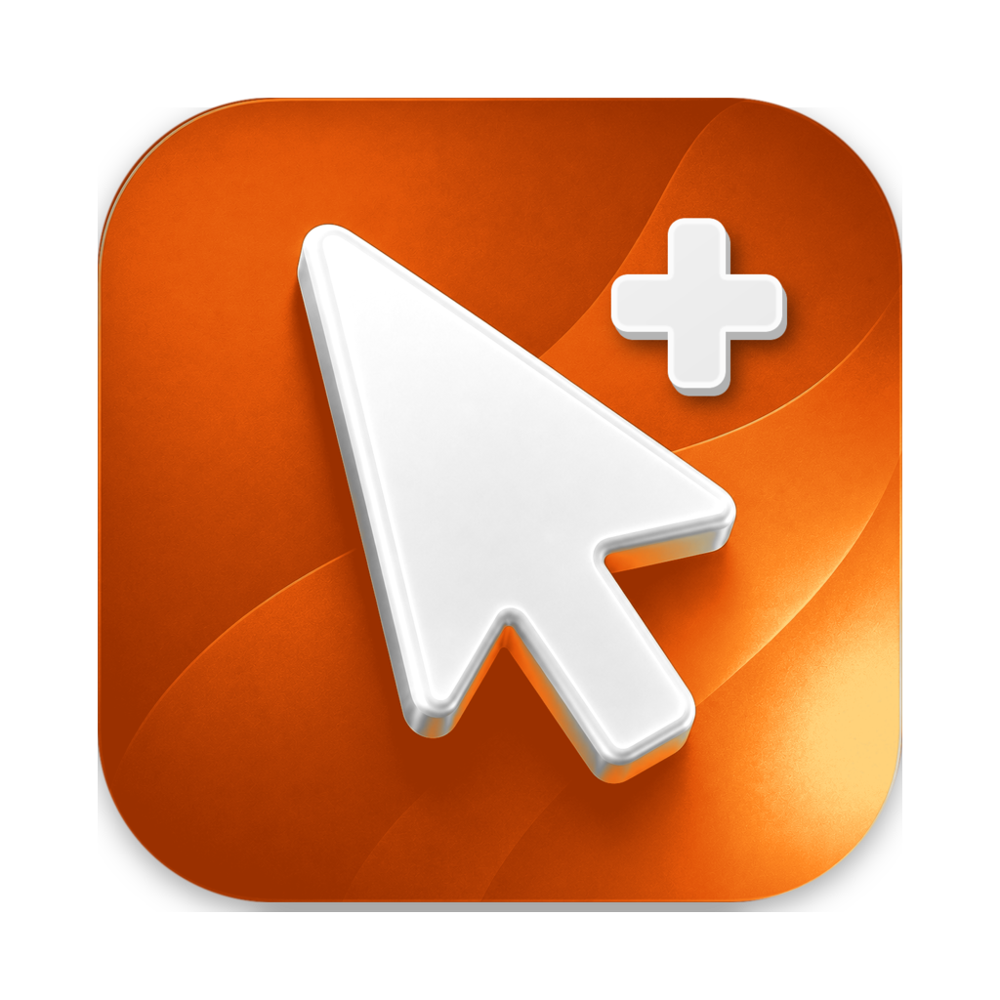
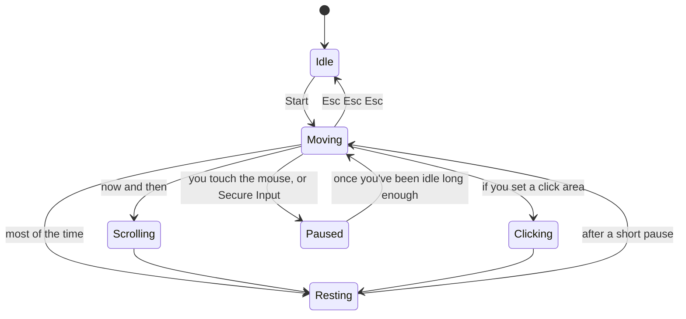

<div align="center">



# Cursor+

**Keeps your Mac awake by moving the cursor like a hand, not a metronome.**


<picture>
  <source media="(prefers-color-scheme: dark)" srcset="docs/cursor-hero-dark.svg">
  
</picture>

</div>

A menu bar app that moves your real cursor along curved, varied-speed paths, with the odd slow scroll, and steps aside the moment you touch the mouse or keyboard.

> [!NOTE]
> A personal tool for your own Mac. It synthesizes input, so don't run it on a work-managed (MDM) Mac.

## Features

- **Hand-like motion**: curved paths, four speed presets, a faint tremor, the occasional slow scroll.
- **Out of your way**: pauses the instant you use the mouse or keyboard, freezes on password fields, stops with <kbd>Esc</kbd> <kbd>Esc</kbd> <kbd>Esc</kbd>.
- **Start After Idle**: waits until the Mac has sat untouched for 3 seconds to 30 minutes, like a screen saver.
- **Auto-start on Wi-Fi**: runs by itself on the networks you save, and stops when you leave them.
- **Sleeps with the display**: optionally ends the session and sleeps the Mac when the display turns off.
- **Click and avoid areas**: draw rectangles it may click inside, and ones it must never enter.

## Install

Needs macOS 14+ and the Swift toolchain.

```bash
./scripts/build_app.sh --open
```

Builds, signs and installs `Cursor+.app` to `/Applications`, then launches it. To keep permissions across rebuilds, create a self-signed **CursorPlus Self** code-signing certificate once; the script picks it up. Details are at the top of [`build_app.sh`](scripts/build_app.sh).

## Permissions

Turn on Cursor+ in **System Settings › Privacy & Security › Accessibility**. Auto-start on Wi-Fi also asks for Location, only to read the network name.

If something is missing, the top line of the menu reads **needs permission · Fix…**. Click it for a checklist and a button straight to the right settings pane.

## Using it

| Menu section | What's there |
|---|---|
| **Motion** | speed preset, wander interval, scrolling, idle pauses |
| **Areas** | click areas and avoid areas, drawn in a full-screen editor (<kbd>Tab</kbd> switches, <kbd>Esc</kbd> done) |
| **Display & Sleep** | prevent display sleep, sleep the Mac when the display turns off |
| **Automation** | Start After Idle, Auto-Start on Wi-Fi, Open at Login |

To stop: <kbd>Esc</kbd> ×3, **Stop** in the menu, or `open cursorplus://quit`. If the menu bar icon is hidden behind the notch, open the app again and its menu pops up at the mouse.

<details>
<summary><b>How it works</b></summary>
<br>

A small state machine wanders, sometimes scrolls, sometimes visits a click area, then rests, and hands control back the moment you touch anything.



Each move picks a speed class, then a velocity inside it. The four presets shift where that speed lives:

<div align="center">
<picture>
  <source media="(prefers-color-scheme: dark)" srcset="docs/cursor-speed-dark.svg">
  
</picture>
</div>

Avoid areas are handled before a path exists: destinations are picked outside them, and a move that would cut through one is routed around its corners as a single continuous curve.

| File | Role |
|---|---|
| `StateMachine.swift` | the wander, scroll, click, rest rhythm |
| `MovementEngine.swift`, `InputEngine.swift` | curved paths and speed, and posting the moves |
| `AvoidZones.swift` | routing around avoid areas |
| `AutoPause.swift`, `KillSwitch.swift` | stepping aside on real input, and the Esc Esc Esc stop |
| `NetworkTrigger.swift` | Auto-start on Wi-Fi |
| `ZoneEditor.swift` | the full-screen area editor |

</details>

## License

[MIT](LICENSE) © 2026 Ahmed Ufuk Serce. Use it only where that's allowed.
